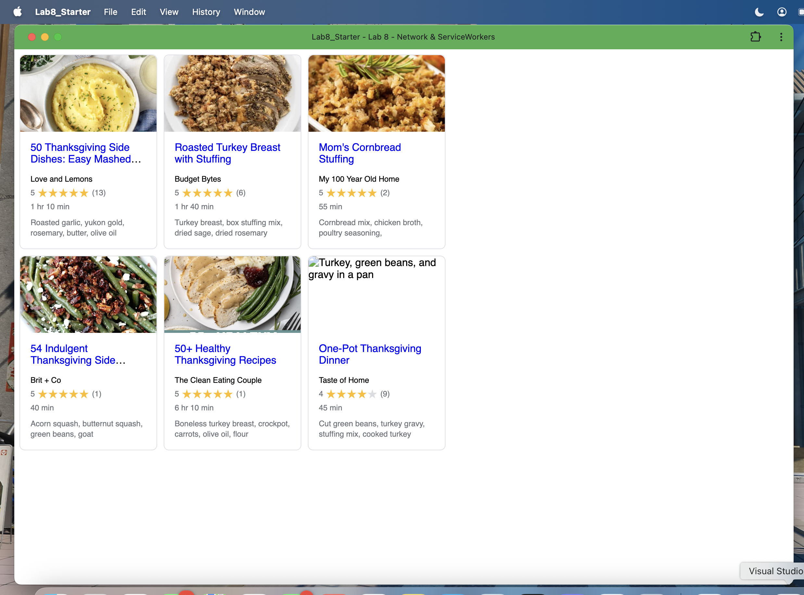

# Lab8-Starter

## PWA Screenshot

## Deployed Site
[https://zaylh17.github.io/Lab08_Starter/](https://zaylh17.github.io/Lab08_Starter/)

## How are graceful degradation and service workers related?
Graceful degradation and service workers are deeply connected because service workers are one of the key tools that allow a web app to degrade gracefully when network conditions worsen. Graceful degradation is the practice of building an app that delivers the best possible experience under ideal conditions, while still functioning at lower capability levels. 

For example, when a user has a slow connection or no internet at all, service workers ensure that the app continues to work instead of breaking compeletly by intercepting network requests and serving cached versions of resources. In this lab, even when the user is fully offline, the recipe cards still load because the service worker has cached the HTML, CSS, JavaScript, and recipe JSONs from earlier visits. Without service workers, the app would be completely dependent on the network and would fail abruptly when the connection dropped.